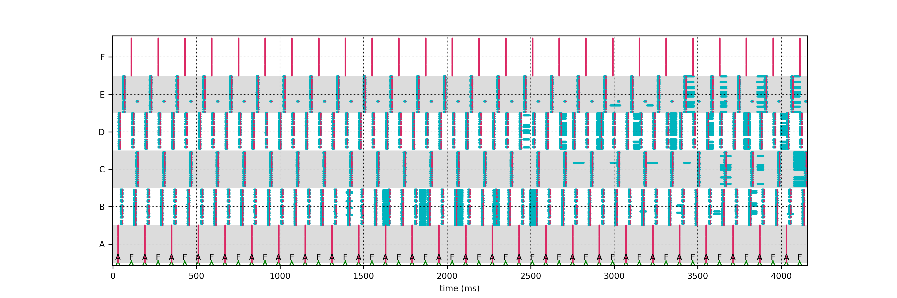

<!-- HEADER -->
<div id="header_wrap" class="outer">
<header class="inner">
<h1 id="project_title"><span style="font-size:90% !important">From single-cell modeling to large-scale network dynamics with NEST Simulator</span></h1>
<!-- <h2 id="project_tagline">No tagline here</h2> -->
</header>
</div>

<!-- MAIN CONTENT -->
<div id="main_content_wrap" class="outer">
<section id="main_content" class="inner">

<link rel="stylesheet" type="text/css" media="screen" href="https://pages-themes.github.io/slate/assets/css/style.css?v=dd924ed8bde9d034c169c8f6d051bf93723eabbd">
<link rel="stylesheet" type="text/css" media="screen" href="stylesheet.css">
<script src="moment.js"></script>
<script src="moment-timezone-with-data.js"></script>

<p style="margin-top: -1em; text-align: center; font-style: italic !important">An on-site tutorial at the [33nd Annual Computational Neuroscience Meeting (CNS*2024)](https://www.cnsorg.org/cns-2024)<br>July 20-24th, 2024</p>

## Description

NEST is an established, open-source simulator for spiking neuronal networks, which can
capture a high degree of detail of biological network structures while retaining high
performance and scalability from laptops to HPC [1]. This tutorial offers a hands-on
experience in building and simulating neuron, synapse, and network models. It introduces
several tools and front-ends to implement modeling ideas most effectively. Participants do
not have to install software as all tools are accessible via the cloud. All parts of the tutorial are hands-on, and take place via Jupyter notebooks.

We develop a functional spiking network that can be trained to solve various tasks using an online, bio-inspired learning rule that approximates backpropagation through time: eligibility propagation (e-prop). Specifically, we use e-prop for training a network to solve a supervised classification task in which evidence needs to be accumulated over time, and generate arbitrary temporal patterns in a supervised regression task.

In this tutorial, a neuron and synapse model are defined in NESTML that are subsequently used in a network to perform learning, prediction and replay of sequences of items, such as letters, images or sounds. The architecture learns sequences in a continuous manner: the network is exposed to repeated presentations of a given ensemble of sequences (e.g., {A,D,B,E} and {F,D,B,C}). At the beginning of the learning process, all presented sequence elements are unanticipated and do not lead to a prediction. As a consequence, the network generates mismatch signals and adjusts its synaptic strengths to minimise the prediction error.


### Citations

[1] [https://nest-simulator.readthedocs.org/](https://nest-simulator.readthedocs.org/)

[2] [https://nest-desktop.readthedocs.org/](https://nest-desktop.readthedocs.org/)

[3] Diaz-Pier S, Naveau M, Butz-Ostendorf M, Morrison A (2016). Automatic
Generation of Connectivity for Large-Scale Neuronal Network Models through
Structural Plasticity. Frontiers in Neuroanatomy, Vol. 10.
<a href="https://doi.org/10.3389/fnana.2016.00057">https://doi.org/10.3389/fnana.2016.00057</a>

[4] [https://nestml.readthedocs.org/](https://nestml.readthedocs.org/)

[5] Potjans W, Morrison A, Diesmann M (2010). Enabling functional neural circuit
simulations with distributed computing of neuromodulated plasticity.
Frontiers in Computational Neuroscience, 4:141. DOI:
<a href="https://doi.org/10.3389/fncom.2010.00141">https://doi.org/10.3389/fncom.2010.00141</a>


## Schedule (on-site tutorial)

<script>
var default_tz = 'Europe/Paris';

var start_time = moment.tz("2024-07-20 09:00", "America/Fortaleza"); // !!! also update start time in the <noscript> table in plain HTML

s = "<label for=\"tz-selector\">Timezone:&nbsp;</label>";
s += "<select class=\"select-css\" name=\"tz-selector\" id=\"tz-selector\" onChange=\"printTable(document.getElementById('schedule'), document.getElementById('tz-selector').value);\">";

moment.tz.names().forEach(function (item, index) {
	s += "<option value=\"" + item + "\"";
	if (item.localeCompare(default_tz) == 0) {
		s += " selected=\"selected\"";
	}
	s += ">" + item + "</option>";
});

s += "</select>";
document.write(s);

document.getElementById('tz-selector').value = default_tz;

function printTable(el, in_tz) {
	//alert(in_tz);
	for (var i = 0; i < document.getElementsByClassName('timecell').length; ++i) {
		item = document.getElementsByClassName('timecell')[i];
		orig_time = item.querySelector('noscript').innerHTML.replace(/^\s+|\s+$/g, '');
		//alert('orig time: ' + orig_time);
		//alert('attempted new time: ' + start_time.format("YYYY-MM-DD HH:mm:ss").slice(0, -8) + orig_time + ":00");
		//alert('new time with date: ' + moment.tz(start_time.format("YYYY-MM-DD HH:mm:ss"), "Europe/Berlin").tz(in_tz).format("YYYY-MM-DD HH:mm:ss"));
		new_time = moment.tz(start_time.format("YYYY-MM-DD HH:mm:ss").slice(0, -8) + orig_time + ":00", default_tz).tz(in_tz);
		if (i == 0) {
			//alert('new time: ' + new_time.format("dddd MMMM Do, HH:mm"));
			document.getElementById('start_date_time').innerHTML = new_time.format("dddd MMMM Do, HH:mm");
		}
		//alert('new time: ' + new_time.format());
		item.innerHTML = "<noscript>" + orig_time + "</noscript>" + new_time.format('HH:mm');
	}
}

window.addEventListener('load', (event) => {
	printTable(document.getElementById('schedule'), document.getElementById('tz-selector').value);
});

</script>

The tutorial will start on <span id="start_date_time">Saturday, July 20th, 09:00</span>. <!-- !!! also update start time in the JavaScript code, and in the <noscript> table in plain HTML -->

<div id="schedule" name="schedule">
<table>
<tr>
<th>Time <noscript>(Natal<br>timezone)</noscript></th>
<th>Description</th>
</tr>
<tr>
<td class="timecell"><noscript>09:00</noscript></td>
<td>Overview and introduction to NEST Simulator<br><span style="font-style:italic">Joshua Boettcher, Jasper Albers</span></td>
</tr>
<tr>
<td class="timecell"><noscript>09:20</noscript></td>
<td>Pattern generation and classification using eligibility propagation (e-prop)<br><span style="font-style:italic">Joshua Boettcher, Jasper Albers</span></td>
</tr>
<tr>
<td class="timecell"><noscript>10:10</noscript></td>
<td>Coffee break</td>
</tr>
<tr>
<td class="timecell"><noscript>10:40</noscript></td>
<td>Creating neuron-astrocyte networks<br><span style="font-style:italic">Iiro Ahokainen</span></td>
</tr>
<tr>
<td class="timecell"><noscript>12:10</noscript></td>
<td>Lunch break</td>
</tr>
<tr>
<td class="timecell"><noscript>14:00</noscript></td>
<td>Sequence learning with third-factor plasticity in NESTML<br><span style="font-style:italic">Jasper Albers</span></td>
</tr>
<tr>
<td class="timecell"><noscript>15:30</noscript></td>
<td>Coffee break</td>
</tr>
<tr>
<td class="timecell"><noscript>16:00</noscript></td>
<td>Compartmental models<br><span style="font-style:italic">Joshua Boettcher</span></td>
</tr>
<tr>
<td class="timecell"><noscript>17:15</noscript></td>
<td>Closing</td>
</tr>
</table>
</div>


## Materials

Course materials (presentations and notebooks) are available in our repository.

For presentations:

[https://github.com/clinssen/OCNS-2024-NEST-workshop/tree/master/presentations](https://github.com/clinssen/OCNS-2024-NEST-workshop/tree/master/presentations)

For the tutorial notebooks:

[https://github.com/clinssen/OCNS-2024-NEST-workshop/tree/master/materials](https://github.com/clinssen/OCNS-2024-NEST-workshop/tree/master/materials)


## Links

<div style="text-align:center">[](https://nest-simulator.readthedocs.io/)<br>[<span style="font-size:120%; font-weight: 120%">NEST Simulator</span>](https://nest-simulator.readthedocs.io/)</div>

<p>NEST Simulator is a spiking neuron simulator which specialises in point neurons and neurons with few comparments. It can simulate synaptic plasticity, structural plasticity, gap junctions and countless other features on machines ranging from home PCs to high-performance computing systems.</p>

<div style="text-align:center">[](https://nest-desktop.readthedocs.io/)<br>[<span style="font-size:120%; font-weight: 120%">NEST Desktop</span>](https://nest-desktop.readthedocs.io/)</div>

<p>NEST Desktop is a web-based GUI application for NEST Simulator. It enables the rapid construction, parametrization, and instrumentation of neuronal network models.</p>

<div style="text-align:center">[](https://nestml.readthedocs.io/)<br>[<span style="font-size:120%; font-weight: 120%">NESTML</span>](https://nestml.readthedocs.io/)</div>

<p>NESTML is a domain-specific modeling language and code-generation toolchain. It supports the specification of neuron models in an intuitive and concise syntax. Optimised code generation for the target simulation platform couples a highly accessible language with good simulation performance.</p>


## Registration

Please don't forget to [register](https://ocns.memberclicks.net/cns-2024-registration) for the on-site meeting in Natal. Registration is required.

Tutorials are not recorded and are not livestreamed events on YouTube. Please note that this is an on-site event only.

<!-- ## Connection details

To allow for interactive sessions, tutorials will run as “virtual rooms” (i.e. video calls) in CNS*2022. The platform is [Zoom](https://zoom.us/). It can run in your browser, and no account or installation is required. In some cases, installing the software on your local computer can improve the quality of the video and audio.

**The link for the tutorial video stream will been announced on the [Sched instance for CNS*2021](https://cns2021online.sched.com)**

-->

## Software requirements

We will provide login details for virtual machines running on Jülich Supercomputer Centre infrastructure to registered participants. You will be able to access the required software directly from your browser, without requiring any installation. Access is provided to a NEST Desktop instance, as well as a [JupyterLab](https://jupyterlab.readthedocs.io/) environment that includes NEST Simulator and NESTML.

Please register your account beforehand! See [HPC account registration](hpc_registration.html) for mode details.

You can also run the software on a local computer. We suggest using two Docker images that we provide:

* [JupyterLab server with NEST and NESTML support](https://github.com/clinssen/OCNS-2024-NEST-workshop/tree/master/docker_containers/nest-nestml-tutorial)

  Launches a Jupyter Notebook server on localhost at port 7003. The password is: **nest25years**

  The image is available via DockerHub. To install:

  ```
  docker pull clifzju/nest-nestml-jupyterlab-ocns-tutorial
  ```

  Then run the image while forwarding the port:

  ```
  docker run -i -d -p 7003:7003 -t clifzju/nest-nestml-jupyterlab-ocns-tutorial
  ```

  You can then access the server in your browser by navigating to the URL [http://localhost:7003](http://localhost:7003).

  The Docker container can be started in interactive mode (giving you a shell prompt) by omitting the ``-d`` parameter.

* [NEST Desktop Docker image](https://github.com/nest-desktop/nest-desktop/tree/dev/docker)

  For local installation, we recommend to use the official NEST Desktop Docker image and instructions. Full instructions can be found at: [https://nest-desktop.readthedocs.io/en/latest/deployer/deploy-docker-compose.html](https://nest-desktop.readthedocs.io/en/latest/deployer/deploy-docker-compose.html).


## Feedback

If you participated in (any part) of this tutorial, we value your feedback! Please take a moment to fill in our short feedback form at [https://forms.gle/yv9MwmAKJugTs2mR9](https://forms.gle/yv9MwmAKJugTs2mR9).


## Organisation

This tutorial is organised by (in alphabetical order):

Iiro Ahokainen (Tampere University, Finland), Jasper Albers (Jülich Research Centre, Germany), Pooja Babu (Jülich Research Centre, Germany), Joshua Boettcher (Jülich Research Centre, Germany), Jens Bruchertseifer (Trier University, Germany), Leander Ewert (Jülich Research Centre, Germany), Charl Linssen (Jülich Research Centre, Germany), and Willem Wybo (Jülich Research Centre, Germany)

For general inquiries, please contact Charl at <a href="mailto:c.linssen@fz-juelich.de">c.linssen@fz-juelich.de</a>.


## Acknowledgements

We acknowledge the use of [Fenix Infrastructure](https://fenix-ri.eu) resources, which are partially funded from the European Union's Horizon 2020 research and innovation programme through the ICEI project under the grant agreement No. 800858.

</section>
</div>

<!-- FOOTER  -->
<div id="footer_wrap" class="outer">
<footer class="inner">

<p class="copyright" style="color: #cccccc">Slate theme maintained by <a href="https://github.com/pages-themes">pages-themes</a> &bullet; Published with <a href="https://pages.github.com">GitHub Pages</a> &bullet; Timezone magic thanks to <a href="https://momentjs.com/">moment.js</a></p>
</footer>
</div>
